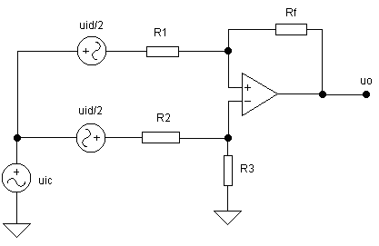
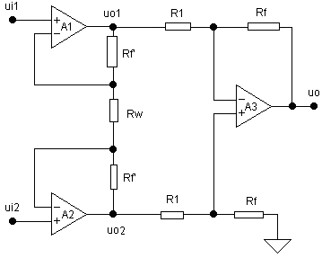
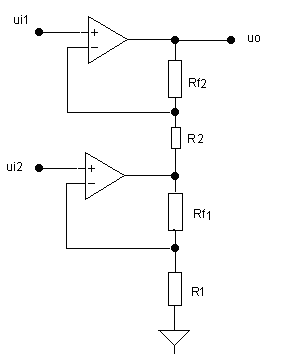
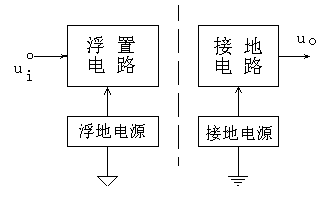
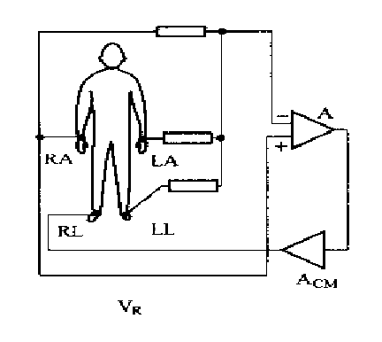
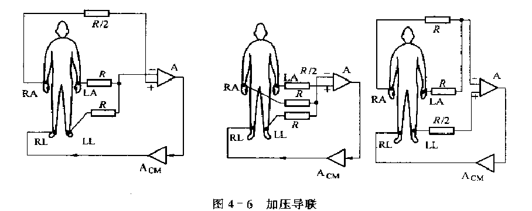

#   医学仪器原理_背诵

##  第一章

### 记录显示设备按其工作原理不同，可以分为：

*   直接描记式记录器
*   磁记录器
*   数字式显示器

### 医学仪器的主要技术特性

*   准确度（accuracy）
*   精密度（precision）
*   输入阻抗（input impedance）
*   灵敏度（sensitivity）
*   频率响应（frequency response）
*   信噪比（signal to noise ratio）
*   零点漂移（zero drift）
*   共模抑制比（CMRR——common rejection ratio）

### 医学仪器的分类

1.  基本分类方法

    *   根据检测的生理参数来分类
    *   根据转换原理的不同进行分类
    *   根据生理系统中的应用来分类
    *   根据临床的专业进行分类

2.  医学仪器按用途分类

    *   诊断用仪器
    *   理疗用仪器

### 建模

1.  模型分类

    *   物理模型
    *   数学模型
    *   描述模型

2.  建模方法

    *   理论分析法建模
    *   类比分析法
    *   数据分析法

2.  建模案例(P16)

    *   无创血氧饱和度检测(理论分析法建模)
    *   无创连续血压测量(类比分析法)
    *   心律变异性分析(数据分了析法)

## 第二章

### 干扰形成的三个条件:干扰源、耦合通道(引入方式)、敏感电路(接受电路)

1.  干扰源

    *   能产生一定电磁能量影响周围电路正常工作的物体或设备称为干扰源。
    *   造成生物点信号提取过程中的主要干扰是近场50Hz的干扰源。

2.  耦合通道

    1.  传导耦合
    2.  经公共阻抗耦合
    3.  电场和磁场耦合
        *   远场（辐射场）

            观察点到长远距离大于&lambda;/2&pi;

        *   近场

            观察点到长远距离小于&lambda;/2&pi;

        *   频率低于1MHz时测试系统内的耦合大多数由近场造成。
        *   电场通过电容性耦合引入干扰，磁场通过电感性耦合引入干扰，远场通过电线源、生物电位电极引线引入干扰。

    4.  近场感应耦合
        1.  电容性耦合
            *   减小容性耦合的常用的有效方法是采用屏蔽导线。
        2.  电感性耦合
            *   采取下述方法减小
                1.  远离干扰源，削弱干扰的影响。
                2.  采用绞合线的走线方式。
                3.  尽量减少耦合通路，即减少面积A和cos&theta;值。

    5.  生物电测量中电场的电容性耦合
        1.  导联线形成容性耦合
        2.  人体表面形成容性耦合

    6.  生物电测量中磁场的感性耦合

###  合理接地

1.  安全接地(保护接地)

    *   分别单独接地、共用一条接地线、分组共用

2.  工作接地(对信号电压设立基准电位)
    1.  一点接地方式：分串联和并联形式 。

    2.  高频回路的多点接地方式

        *   多点接地，电路中所用的地线分别连到最近的低阻抗地线排上，地线排一般用大面积的镀银铜皮。

    3.  低频的电子系统接地

        *   一个低频电子系统中，至少要有三个分开的地线：低电平信号地线；功率地线；机壳地线

###  屏蔽效果

1.  屏蔽有主动屏蔽和被动屏蔽两种。

2.  屏蔽效果

    1.  吸收损耗
        *   提供吸收损耗方面，钢比铜好
        *   吸收损耗随屏蔽体厚度和电磁场频率的增加而增加

    2.  反射损耗
        *   屏蔽阻抗愈低，反射损耗愈大，为增强屏蔽效果，可选用高电导率和低磁导率的材料。
        *   钢虽然比铜的吸收损耗大，
但反射损耗却较小。

    3.  低频平面波的大量衰减是来自反射损耗；在高频时的大量衰减是来自吸收损耗。
    4.  选择屏蔽材料的原则是：

        *   屏蔽电场或远场的平面波（辐射场）时宜选择铜、铝、钢等高电导材料；R &rarr;&omega;&mu;/&sigma;
        *   低频材料的屏蔽，宜选择玻莫合金、锰合金、、磁钢、铁等高磁导率材料。&delta;&rarr;1/&omega;&mu;&sigma;

### 其它抑制干扰的措施
1.  隔离
2.  去耦
3.  滤波
4.  系统内部干扰的抑制

### 测试系统的噪声
*   噪声定义：测量系统内部由器件、材料、部件的物理因素产生的自然扰动。
*   系统噪声特点

    *   噪声是电路内固有的，不能用接地或屏蔽等方式消除
    *   内部噪声成为测量精度的限制性因素
    *   各种生物电放大器输入端短路噪声限制了放大器能够检测的最小生物电信号

*   降低系统噪声方法：通过对噪声过程的分析，进行合理的低噪声电路设计，可以将噪声降到合理程度。

*   噪声一般性质

    *   当噪声的功率谱S(f)为一常数时，噪声称为白噪声；
    *   当噪声的功率谱S(f)不是一常数时，噪声称为有色噪声。
    *   谱密度随频率减小而上升，称为粉红色噪声。
    *   段的噪声谱密度随频率的上升而增加，称为蓝噪声。

*   生物医学测量系统中的主要噪声类型

    1.  1/f噪声－－闪烁噪声、低频噪声 (low frequency noise)

        *   S(f) = K/f
        *   各有源器件在制作工艺过程中，材料表面特性及半导体器件中结点中的缺陷等，是1/f 噪声的**主要成因**。
        *   减小低频噪声措施

            1.  在噪声性能要求高的放大器中尽量使用分立元件。
            2.  尽量使用金属膜电阻而不使用碳膜、水泥等有不连续介质的电阻。

    2.  热噪声 (hot noise)

        *   热噪声是由半导体中载流子的随机热运动引起的 。任何处于绝对零度以上的导体中，电子都在作随机热运动。
        *   热噪声的谱密度与工作频率f无关，属于白噪声 。
        *   热噪声电压均方值与绝对温度T成正比，热噪声电压还与工作频带成正比，与电阻阻值成正比。
        *   电阻R的热噪声的电压均方值:$U^2$ = 4kTR&Delta;_*f*_,谱密度P(_*f*_)=4kTR
        *   减小热噪声的措施

            1.  在微弱信号检测的低噪声电子设备中，常利用超低温技术来减小噪声。
            2.  在保证信号不失真传输的条件下，应尽量减小系统的频带，提取信号的
传感器电阻应尽可能小。
            3.  避免增加额外的串联电阻。
    3.  散粒噪声 (shot noise)
        *   在半导体器件中，由于载流子产生与消失的随机性，流动的载流子数目发生波动而引起电流的瞬时涨落称为散粒噪声。
        *   属于白噪声，其谱密度为2qIDC。散粒噪声与流过半导体PN结位垒的电流有关。在简单的导体中没有位垒，因此没有散粒噪声。

### 描述放大器噪声性能的参数

1.  $U_n,I_n$参数(P51)
    *   $U_{ni}^{2}=U_{ns}^{2}+U_{n}^{2}+I_{n}^{2}R_{s}^2$

2.  噪声系数(P52)

    *   低噪声设计的目的是使NF值尽可能小。
    *   最小噪声系数,最佳源电阻$R_{so}=U_{n}/I_{n}$
    *   噪声系数的价值是用于比较放大器的噪声，它并不适于作为放大器低噪声设计的依据。

3.  多级放大器的噪声(P54)
    *   多级放大器的噪声系数为$F=F_1+\frac{F_1-1}{A_{p1}}+\frac{F_2-1}{A_{p1} \cdot A_{p2}}+\cdots$
    *   结论：第一级放大器的噪声系数对总噪声系数的贡献最大，努力降低第一级的噪声，是实现低噪声设计原则。

### 器件的噪声
1.  电阻的噪声
    *   电阻中都存在热噪声，只要R、T相同则热噪声就相同。
    *   合成碳质电阻器1/f噪声最大，金属膜和线绕电阻1/f噪声较小。

2.  电容器的噪声
    *   电容器实际存在介质损耗，即电容器的漏电，相当于理想电容器两端并联一个电阻Rp，所以构成了电容器阻抗的实数分量，成为电容器的热噪声源;同时存在1/f噪声。

3.  场效应管的噪声
    1.  沟道热噪声
    2.  栅极散粒噪声
    3.  1/f噪声
    4.  结论
        *   低夹断电压Up、高跨导gm的场效应管，并工作在漏极饱和电流$I_{DSS}$邻近，具有低噪声系数。
        *   一般场效应管栅源电阻$R_{GS}>10^7\Omega$,当$R_{S0}=R_{GS}$时有最小噪声系数，当信号源电阻高时，选用场效应管作输入级是理想的。

4.  双极晶体管的噪声
    *   基区扩散电阻rbb’的热噪声。
    *   基极电流$I_B$和集电极电流$I_C$起伏产生散粒噪声。
    *   基极电流$I_B$流经基极-发射极耗尽区，产生1/f噪声。
    *   为减小1/f噪声，应相应减小基区电阻并选择尽可能低的静态工作点。

5.  运算放大器的噪声
    *   集成器件的噪声是组成它的各元件噪声的综合，通常以其输入端噪声参数$U_n$、$I_n$表示。

### 低噪声放大器设计
*   用放大器输入端对地短路时的固有噪声$U_{ni}$作为放大器的噪声性能指标。
*   调整$R_s$或使$U_n/I_n$比值在已知的$R_s$附近，称为噪声匹配。
*   总原则：多级放大系统中第一级噪声是主要的，但后面各级也贡献噪声。因此在多级放大系统设计时，必须严格考虑各级的噪声，包括偏置元件的噪声。
*   实际设计原则：
    1.  使第2级及以后各级的等效输入噪声与第一级的噪声相比很小。
    2.  在满足其他噪声条件下，第一级增益应尽可能高。
    3.  在有源器件负载允许的条件下，尽量选择低阻值的外回路电阻（尤其是输入级）。

##  第三章

### 生物电放大器前置级基本要求

1.  高输入阻抗(了解放大器前置级需要高输入阻抗的原因)

    *   如果放大器输入阻抗不够高（与源阻抗相比），就会造成信号低频分量的幅度减少，产生低频失真。

        *   生物电信号源是高内阻的微弱信号。
        *   信号源阻抗不稳定。（因人而异，因身体状况而异，与电极安装位置、电极本身的物理状态都有密切关系）
        *   源阻抗是频率的函数。
        *   电极阻抗随电流密度的变化而变化。

2.  高共模抑制比(什么是共模抑制比；为什么放大器前置级需要高共模抑制比；)

    *   $CMRR= \frac{A_d}{A_c}$
    *   $CMR = 20 log_{10} CMRR$
    *   为了抑制人体所携带的工频干扰及所测量的参数外的其他生理作用的干扰，须选用差动放大形式。
    *   值得注意的是：放大器的实际共模抑制抑制能力受前面电极系统的影响。$Z_{s1} \neq Z_{s2}$，使共模干扰转化为差模干扰。
    *   $Z_i \gg Z_s$时，共模输入电压转换为输入差模电压$u^{'}_{id} = u_{ic} \Delta Z_s / Z_i$

3.  低噪声，低漂移(了解低噪声、低漂移是前置放大器的重要要求；)

    *   低频生物电信号特点：
        1.  幅值低（微弱信号）仅在微伏、毫伏级；
        2.  高阻抗源，本身带来相当高的热噪声（输入信号质量差）；
        3.  具有十分低的频率成分。

4.  设置保护电路

### 差动放大电路分析方法

1.  掌握理论分析简单差动放大电路（图3-2）的差模增益、共模增益和共模抑制比；
    *   理想情况下
2.  了解该电路电阻匹配误差与放大器电路的共模抑制能力的关系；
3.  了解整个差动放大电路（图3-2）的CMRR，与电阻失配($CMRR_R$)和器件本身($CMRR_D$)的关系，并通过这种关系，如何减小整个差动放大电路的CMRR；
    *   
    *   理想情况下

        *   令$u_{oc}=0$且$R_1 \parallel R_F=R_2 \parallel R_3$
        *   得到$R_1=R_2$$R_f=R_3$
        *   $A_d=-\frac{R_F}{R_1}$
        *   $CMRR = \infty$

    *   存在电阻失配$CMRR_R$和器件本身$CMRR_D$
        *   设电阻匹配误差$\delta$
        *   $CMRR_R = \frac{1+A_d}{4\delta}$
        *   电阻匹配误差越小，闭环差模增益越大，放大器的共模抑制能力越大。
        *   令$u^{'}_{ic}$为$u^{'}_{oc}$折合到放大器输入端的共模误差电压
        *   $u^{'}_{ic}=\frac{u_{ic}}{CMRR_D}$
        *   说明共模输入电压因为转化成差模电压而形成共模干扰电压。
        *   所以，共模输出$u_{oc}$实际是由$CMRR_D$有限而产生的共模误差电压，折合到输入端，相当于一差模电压$u^{'}_{ic}$，它与差动信号一起被放大$A_d$倍。
        *   总共模抑制比$CMRR = CMRR_D \parallel CMRR_R$

    *   基本差动电路的输入阻抗问题

        *   $r_i \approx 2R_1$
        *   这种基本放大电路的
输入阻抗不能满足生物电放
大器前置级的要求

4.  同相并联结构的前置放大器：如何求其差模增益、共模增益和共模抑制比；了解实现第一级放大电路的高共模抑制比并不困难的原因；了解该两级放大电路的共模抑制比主要取决于第一级的差动增益和第二级共模抑制能力的原因；

    *   
    *   第一级放大增益$A_{d1}=1+\frac{2R^{'}_F}{R_W}$
        *   在第一级电压输出的表达式中，并没有共模电压成分。与基本差动放大电路输出电压表达式相比，同相并联的低一级电路并不要求外回路电阻有任何形式的匹配来保证共模抑制能力，因此避免了须电阻精度匹配的麻烦。
        *   这种并联结构的电路，能方便的实现增益的调节。
        *   第一级电路具有完全对称形式，这种对称结构有利于克服失调、漂移的影响。

    *   第一级共模抑制比

        *   设$A_1$，$A_2$的共模抑制比分别为$CMRR_1$，$CMRR_2$
        *   $CMRR_{12}= \frac{CMRR_1 \cdot CMRR_2}{CMRR_1 - CMRR_2}$
        *   第一级放大电路的模抑制能力取决于运方器件$A_1$，$A_2$本身的共模抑制比的差异。
        *   为了使第一级放大电路获得高共模抑制比，$A_1$，$A_2$器件本身的$CMRR_1$和$CMRR_2$数值是否高并不重要，重要的是他们的对称性。

    *   为了割断共模电压在电路中的传递，最简单有效的方法是在$A_1$，$A_2$并联电路的后面接入一级差动放大。
        *   $A_d=A_{d1} A_{d2}=(1+ \frac{2R^{'}_F}{R_W}) \frac{R_F}{R_1}$
        *   $ \frac {1}{CMRR}
            = \frac{1}{CMRR_{12}} + \frac{1}{CMRR_3 \cdot A_{d1}}$
        *   $CMRR
            = \frac{A_{d1} \cdot CMRR_{12} \cdot CMRR_3}{A_{d1}  \cdot CMRR_3 + CMRR_{12}}$
        *   $A_1,A_2$对称性较好时，$CMRR_{12} \gg A_{d1} \cdot CMRR_3 $，则 $CMRR \approx A_{d1} \cdot CMRR_3$
        *   对称性较好时CMRR主要取决于第一级的差动增益和第二级的共模抑制能力。

6.  同相串联结构的前置放大器：如何求其差模增益、共模增益和共模抑制比；了解该放大电路共模抑制能力的提高，取决于所用器件本身的共模抑制比是否相等，并受外回路电阻的匹配精度的影响；

    *   
    *   令$\frac{R_1}{R_{F1}}=\frac{R_2}{R_{F2}}$，使共模增益为0
    *   差模增益$A_d = 1 + \frac{R_F}{R}$
    *   $CMRR_R \approx \frac{A_d}{2 \delta}$
    *   $\frac{1}{CMRR} = \frac{1}{CMRR_2} - \frac{1}{CMRR_1} + \frac{1}{CMRR_R}$

7.  集成仪表放大器的结构（图3-8）、以及其增益与电阻R_G的关系；熟悉其技术参数；
    *   $G= \frac{2R_1}{R_G}+1 = \frac{49.4k \Omega}{R_G}+1$

8.  屏蔽驱动电路的目的与工作原理；

    *   取出放大电路的共模电压用以驱动屏蔽层，使C1，C2的端电压保持不变，对共模电压不产生分流，产生在共模电压作用下电缆屏蔽层分布电容不复存在的等效效果。
    *   对于共模电压在输入端造成的差模转化，即使放大器的共模抑制比为无穷大，也必将产生共模误差输出。实质上，这是由于这种阻抗的不对称，导致了包括输入回路在内的整个放大系统的共模抑制能力降低。
    *   屏蔽驱动电路的目的是使引线屏蔽层分布电容的两端电压保持相等。

9.  右腿驱动电路的目的与工作原理；
    *   采用右腿取代直接接地，可以使50Hz共模干扰电压降低到1%以下，而对于50Hz 干扰的抑制并不以损失心电图的频率成分为代价。人体的位移电流不再流入地，而是流向R0 和辅助放大器的输出端。
    *   腿不直接接地，而是接到辅助放大器A3的输出端。从两电阻Ra结点检出共模电压，它经辅助的反相放大器放大后，再通过电阻R0反馈到右腿。

### 隔离级设计

1.  图3-14中的电气隔离；

    *   

2.  模拟信号的耦合转换，其目的是为了获得电气隔离后浮置电路与接地电路两端模型信号的线性转换；了解图3-17与图3-18例子中耦合电路获得良好模拟信号线性转换的原理；P84

### 滤波电路
12、了解图2-3中各类信号需要何种滤波器才能在获得的同时，又排除各类干扰源；

13、生理放大器滤波电路的设计：给定各类滤波器电路，判断其滤波器的类型（低通、高通、带通、带阻）（在我给的笔记里面）；

##  第四章 生物电测量仪器
1.  常用的生物医学电极；

    *   当刺激电流达到阈值时，引起兴奋的组织是阴极下的组织。
    *   刺激电极，检测电极

2.  掌握心电图导联中的国际标准十二导联体系；I, II, III, aVR, aVL, aVF,V1~V6与身体上个位置电极的具体连接方式；了解Wilson中心电端；

    *   目前广泛应用的是国际标准十二导联体系，分别记为：Ι,Ⅱ,Ⅲ,aVR、aVL、aVF、V1～V6.其中Ι,Ⅱ,Ⅲ导联为双极导联，aVR、aVL、aVF、V1～V6为单极导联。
    *   获取两个测试点的电位差时，用双极导联；获取某一点相对于参考点的电位时，用单极导联。
    *   在国际标准十二导联体系中，需要在人体安放10个电极，分别位于左臂（LA），右臂（RA），左腿（LL），右腿（RL）以及胸部6个电极（V1～V6）。
    *   双极标准肢体导联（简称标准导联），又叫做Ι,Ⅱ,Ⅲ 导联，它是以两肢体间的电位差为所获取的体表心电信号。
    *   第Ι导联的心电信号是心脏活动时传导到左手和右手上的心电电位差，第Ⅱ导联是传导到右手与左脚之间的电位差，第Ⅲ导联是传导到左手与左脚之间的心电电位差。
    *   $I=U_L-U_R\\II=U_F-U_R\\III=U_F-U_L$， 其余两个肢体接$A_{cm}$的输出端
    *   单极肢体导联的三种连接方式，记为VR,VL,VF。
    *   
    *   用这种网络所获取的心电图叫做单极肢体导联心电图，即通常所说的增广肢体导联，分别叫做aVR，aVL，aVF。
    *   
    *   $aVL= \frac{3}{2}\overline{V}_L\\aVF= \frac{3}{2}\overline{V}_F$
    *   测量心电图时，为了探测心脏某一局部区域电位的变化，将探测电极安放在靠近心脏的胸壁上，参考电极置于威尔逊中心端，探测电极所在部位电位的变化，即为心脏局部电位的变化，这种导联称为单极性胸导联。
    *   $V_n=U_{cn}-(U_R+U_L+U_F)/3$

3.  了解图4-24的心电图机基本结构；

4.  重点：图4-30，浮地前置放大电路中的威尔逊网络连接、导联选择共工作原理、1mV定标电路、电极脱落检测电路、时间常数电路、光电耦合电路、灵敏度选择电路等；

5.  重点：图4-36，键控电路中的电子开关电路、上升/下降编码电路、译码电路、图4-37中锁相环控制稳速、调速的原理等；

6.  重点：图4-40，电源电路中的整流电路、充电及充电指示电路、交流供电电路、蓄电池电压指示电路、自动定时断电保护电路的工作原理等；

7.  了解脑电图基础知识；

    *   α波： 可在头颅枕部检测到，频率为8～13Hz，振幅为20～100μV， 它是节律性脑电波中最明显的波；整个皮层均可产生α波。α波在清醒，安静、闭眼时即可出现，波幅由小到大，再由大到小作规律性变化，呈棱状图形。睁眼、思考问题或接受其它刺激时， α波消失而出现快波，这一现象称为α波阻断，如果被测者安静闭目，则α波又重新出现
    *   β波：β 波在额部和颞部最为明显，频率约为18～30Hz，振幅约为5～20 μV，  是一种快波，β波的出现一般意味着大脑比较兴奋。
    *   θ波：θ波频率为4～7Hz，振幅约为10～50μV（它是在困倦时，中枢神经系统处于抑制状态时所记录的波形。
    *   δ波：在睡眠、深度麻醉、缺氧或大脑有器质性病变时出现，频率为1-3.5Hz，振幅为20～200μV。
    *   诱发电位是指中枢神经系统在感受外在或内在刺激过程中产生的生物电活动，是代表中枢神经系统在特定功能状态下的生物电活动的变化 
    *   非特异性诱发电位：给予不同刺激时产生相同的反应
    *   特异性诱发电位：指在给予刺激后经过一定的潜伏期，在脑的特定区域出现的电位反应，其特点是诱发电位与刺激信号之间有严格的时间关系。

8.  了解脑电图机的导联，与脑电图机的工作原理（图4-59）；
    *   单极导联法，双极导联法，平均导联
    *   头皮电极电阻抗测量电路

9.  了解肌电图的基础知识；

##  第五章 血压测量
*   血压：血管中的血液垂直作用于血管壁上单位面积的压力称为血压。

    1.  收缩压（Systolic pressure，SP)心脏收缩时所达到的最高压力称为收缩压，它把血液推进到主动脉，并维持全身循环。
    2.  舒张压（Diastolic pressure，DP)心脏扩张时所达到的最低压力称为舒张压，它使血液能回流到右心房。
    3.  脉压差：收缩压和舒张压的差称为脉压差，表示血压脉动量，一定程度上反映心脏的收缩能力。
    4.  平均压(Mean Arterial pressure MP ) 血压波形在一周内的积分除以心周期T 称为平均压。正常情况下，平均压可用舒张压加上三分之一的脉压差来表示。
    5.  左心室压反映左心室的泵作用,心室压力曲线的上升沿斜率(dP/dt)反映了心室收缩初期的力度,作为心血管系统的重要功能指征，在舒张期,左心室压一般低于1kPa(8mmHg)。舒张期未端压则代表了在射血开始前，对心室的灌注压力。
    6.  右心室压和肺动脉压：由右心室收缩引起，在正常血液循环中，这两种压力低于系统动脉压。因为肺动脉循环阻力一般只有系统循环阻力的1/4，因此当病人出现严重的肺部疾病（如肺动脉狭窄、室间膈病变等）时会出现肺动脉高压
    7.  中心静脉压：中心静脉压是指右心房、上腔静脉或锁骨下静脉血液所给出的压力。是静脉管的弹力与胸膜压力的总和。中心静脉压是反映静脉系统血液容量和静脉弹力的指数。当总的血容与静脉弹性不变时，静脉压随心功改变而改变。当心脏功能退化时，中心静脉压升高。__因此它是监视人体心脏衰竭的重要指标__。

*   血压测量方法
    *   直接测量
        *   优点：测量值准确，能进行连续测量。
        *   缺点：有创
        *   血管外传感器：将血管内测量点的压力引出(一般通过充满液体的导管)体外，传感器置于体外进行测量
        *   血管内传感器：测量则是将传感器置于导管的顶端，直接进入血管内测试点进行测量。由于不需要置于体外的传感器中所用的传导压力量的液体，因此在频响和时延方面均能达到更理想的指标(一般可达几千赫兹)。
        *   
        *   
        *   零压输出调整：零压输出时，调整失调电位器RP1，血压计显示值为000.0时即可。
        *   前置电路增益调整：调节$R_1$和$R_T$，$A=1+R_1/R_T$
        *   满量程调整：先在显示电路的输出端加上200mV电压，然后调整电位器RP2，使其读数为199.9mmHg即可。
        *   $U_O=-2(1+R_1/R_T)U_I$
        *   
        *   标定方法：P187
    *   间接测量
        *   优点：无创
        *   缺点：测量精度较低，不能进行连续测量以及不能用以测定心脏、静脉系统的压力。
    *   绝对压力、标准压力
    *   在心血液系统中，右心房压最稳定，几乎不受人体姿态变化的影响，这一重要特征，对于使人体在运动中保持循环系统的稳定，起了很重要的作用。

